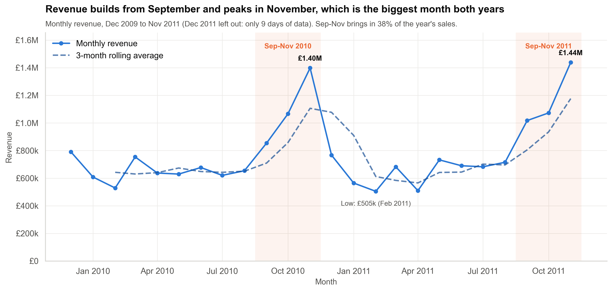
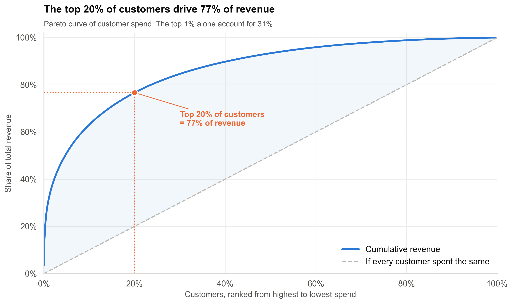
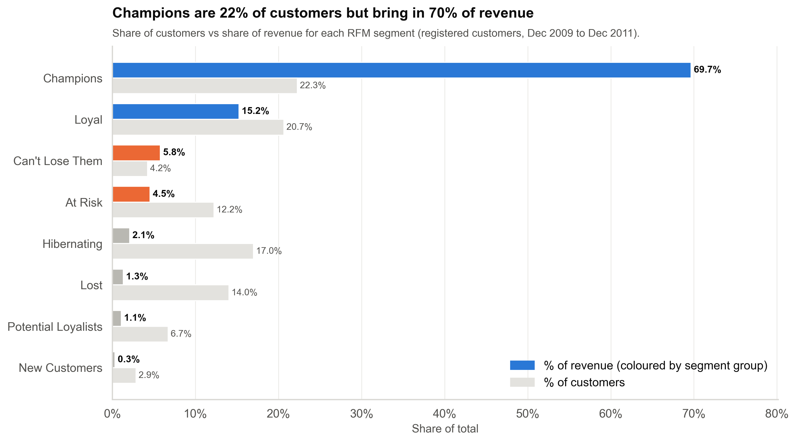
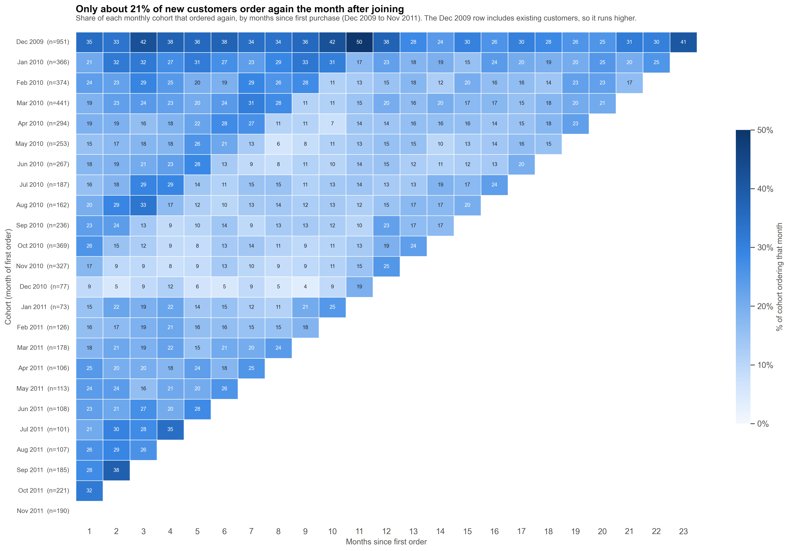
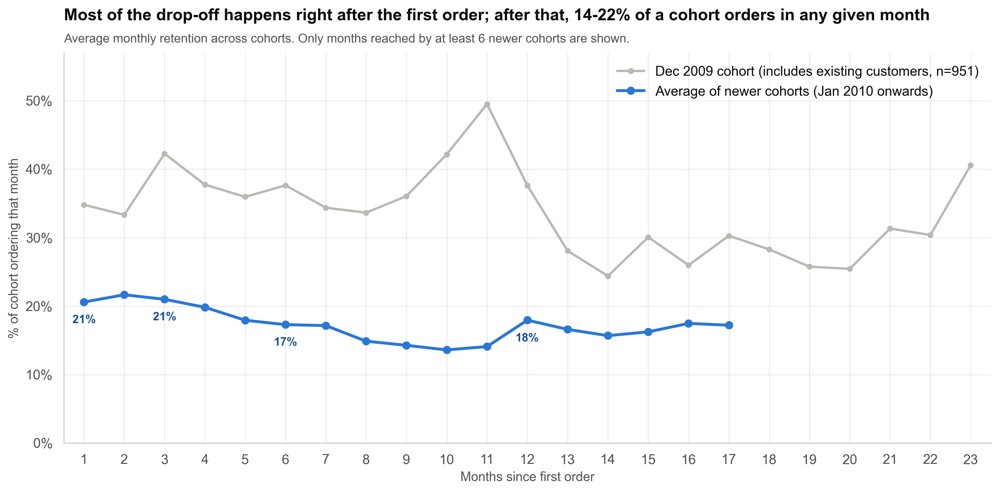

# E-Commerce Sales Analysis, RFM Segmentation & Cohort Retention

This project analyses two years of transactions (Dec 2009 to Dec 2011) from a UK-based online gift retailer. It answers three questions a retail marketing manager would ask: who our best customers are, how revenue is trending, and where we're losing customers.



## The business problem

The retailer sells giftware online, mostly to small businesses and wholesalers. Revenue is flat, the calendar is very seasonal, and marketing doesn't currently treat customers differently based on their value. I wanted to find out:

1. **How is revenue trending?** How big is the Christmas peak, which products and countries matter, and when do people order?
2. **Who are the best customers?** Which customers drive revenue, and how should each group be treated?
3. **Where are we losing customers?** How many new customers come back after their first order, and is that getting better or worse?

## Dataset

**Online Retail II**, UCI Machine Learning Repository: <https://archive.ics.uci.edu/dataset/502/online+retail+ii>

- One Excel workbook with two sheets: `Year 2009-2010` and `Year 2010-2011`
- 1,067,371 rows. Each row is one product line on an invoice: invoice number, stock code, description, quantity, date, unit price, customer ID and country.
- Prices are in pounds sterling.

The raw file isn't committed (it's 44 MB). Download it and save it as `data/raw/online_retail_II.xlsx`.

## Methodology

**1. Cleaning** ([01_cleaning.ipynb](notebooks/01_cleaning.ipynb))
- Combined the two sheets and removed 34,335 exact duplicates. Most of them (22,844) come from 1-9 Dec 2010, which appears in both sheets.
- Separated cancellations (invoices starting with `C`). I counted their value and also removed the 6,180 original order lines that a later cancellation fully reversed, matched on customer, product and quantity. Without that step, a single 80,995-unit order that was cancelled the same day would have made one customer look like the biggest account in the business.
- Removed postage, carriage, fees, manual adjustments, vouchers and test items, plus zero-price stock write-offs.
- Kept orders with no Customer ID in a separate guest-orders file. They're included in revenue analysis but left out of customer analysis.
- Result: 997,160 clean sale lines, 93.4% of the raw file.

**2. Exploratory analysis** ([02_eda.ipynb](notebooks/02_eda.ipynb)): monthly revenue with a 3-month rolling average, top products and countries, a weekday × hour heatmap and the order-value distribution. December 2011 only has 9 days of data, so it's left out of the trend.

**3. RFM segmentation** ([03_rfm_segmentation.ipynb](notebooks/03_rfm_segmentation.ipynb)): Recency, Frequency and Monetary value for each of the 5,839 registered customers, measured at a snapshot date of 10 Dec 2011. Each metric is scored 1-5 with `pd.qcut` on `rank(method="first")`. This is needed because 27.6% of customers have exactly one order and the quintile edges would otherwise collide. The scores are mapped to eight segments with explicit rules, documented in the notebook.

**4. Cohort retention** ([04_cohort_retention.ipynb](notebooks/04_cohort_retention.ipynb)): customers are grouped by the month of their first order, giving 24 cohorts from Dec 2009 to Nov 2011, and tracked month by month. The Dec 2009 cohort is shown but left out of the average curve, because the data starts that month and so it includes long-standing customers, not just new ones.

## Key findings

**1. A small group of customers carries the business.** The top 20% of customers bring in **76.7% of revenue**, and the top 1% (59 customers) bring in **31.1%**. Half of all revenue comes from just 274 customers.



**2. Champions are 22% of customers and 69.7% of revenue.** These 1,301 customers average £8,819 in spend and 16.7 orders, and last ordered about 20 days ago on average.



**3. £1.7M of past revenue sits with customers who have gone quiet.** 962 customers in the At Risk and Can't Lose Them segments spent £1.70M (10.3% of revenue) but haven't ordered in at least six months. 247 of them are Can't Lose Them customers, who averaged £3,857 each and have been gone for an average of 344 days.

**4. Revenue is flat and depends heavily on Q4.** The year to Nov 2011 grew just **+1.7%** (£9.38M vs £9.22M). September to November brings in **37.6%** of annual revenue, and November 2011 was the biggest month on record at £1.44M.

**5. Only about 1 in 5 new customers orders again the month after joining, and fewer new customers are joining.** Month-1 retention averages **20.6%** and then stays between 14% and 22% a month. Most customers do return eventually (75.5% of the 2010 cohorts placed a second order), but irregularly. Meanwhile, new customers fell **41%**, from 1,548 in Jun-Nov 2010 to 912 in Jun-Nov 2011.





Some other things worth knowing:
- The UK accounts for 85.4% of revenue. Ireland is the biggest export market (£606k), but that comes from just 3 customers.
- 78% of orders are placed between 10:00 and 15:59 on weekdays, and there were only 30 Saturday orders in two years.
- The median order is £300 but the mean is £485. Orders of £1,000 or more are 8.5% of orders and 43.1% of revenue.
- Cancellations cost £716k, or 3.65% of gross product sales.

## Recommendations

1. **Look after the Champions first.** 1,301 customers bring in 70% of revenue. Give them early access to new ranges and a named contact, and don't discount them, because they already buy at full price.
2. **Call the 247 "Can't Lose Them" accounts.** That's small enough for an account manager to work through one by one, and they were worth £953k between them. Find out why they stopped before offering anything.
3. **Run win-back campaigns in September and October.** Lapsed customers are most likely to return in November (a 25% return rate vs 11% in January), so reaching At Risk customers just before the peak should get the best response.
4. **Work on the second order.** Month-1 retention is 20.6% and only rises slightly later. A welcome series with a reorder reminder and a first-repeat-order incentive goes after the biggest single drop in the customer lifecycle.
5. **Look into the drop in new customers.** New customers fell 41% year on year while revenue held flat. That's a risk that will show up later, and acquisition spend should be reviewed before the next peak.
6. **Cut spend on Lost and Hibernating customers.** They're 31% of customers but 3.4% of revenue. One low-cost seasonal email is enough; leave them out of paid campaigns.

The full segment-by-segment action table is at the end of the RFM notebook.

## How to run

```bash
git clone <this-repo>
cd ecommerce-rfm-analysis

python -m venv .venv
# Windows: .venv\Scripts\activate    macOS/Linux: source .venv/bin/activate
pip install -r requirements.txt

# Put the dataset at data/raw/online_retail_II.xlsx, then run the notebooks in order:
cd notebooks
jupyter nbconvert --to notebook --execute --inplace 01_cleaning.ipynb
jupyter nbconvert --to notebook --execute --inplace 02_eda.ipynb
jupyter nbconvert --to notebook --execute --inplace 03_rfm_segmentation.ipynb
jupyter nbconvert --to notebook --execute --inplace 04_cohort_retention.ipynb
```

Or open them in Jupyter and run them top to bottom. Notebook 01 must run first because it writes the processed files the others read. Reading the Excel file takes a couple of minutes. Every chart is saved to `images/` at 300 dpi.

## Project structure

```
ecommerce-rfm-analysis/
├── data/
│   ├── raw/                  # online_retail_II.xlsx (not committed)
│   └── processed/            # clean.csv, guest_orders.csv, cancellations.csv, rfm_segments.csv
├── notebooks/
│   ├── 01_cleaning.ipynb
│   ├── 02_eda.ipynb
│   ├── 03_rfm_segmentation.ipynb
│   ├── 04_cohort_retention.ipynb
│   └── style.py              # shared chart theme, palette and save helper
├── images/                   # all charts (PNG, 300 dpi)
├── requirements.txt
└── README.md
```

## Tech stack

Python 3.10 · pandas · NumPy · Matplotlib · seaborn · openpyxl · Jupyter
